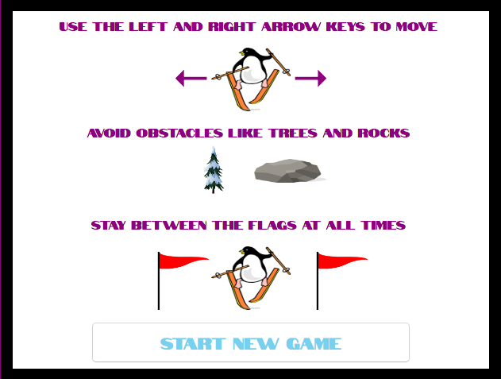
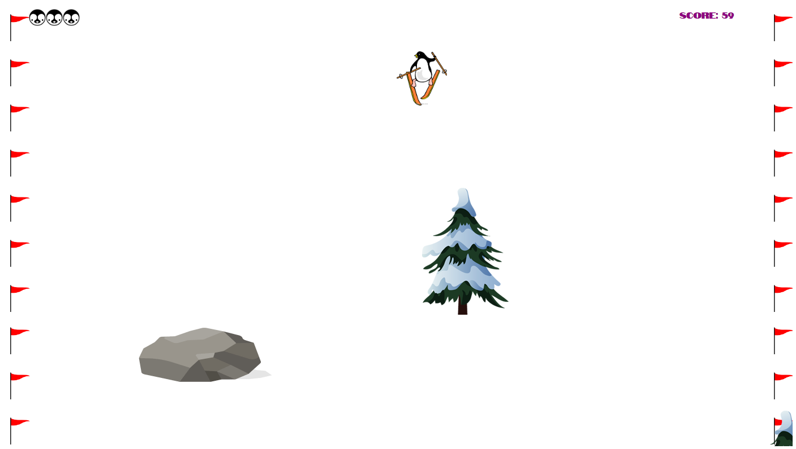

# snowflake

Author: Bryan Lynch
Date: April 02, 2019
Version: 1.0.0

Project Description: Simple javascript game involving Penguin skiing down mountain.

Goal: Avoid obstacles by using the left and right arrow keys to move penguin. Stay between
the flags.

Languages: Pure javascript, HTML, and CSS. Webpack used to bundle js files.

Notes: Game optimized for play on laptop screens. 

Credits: Sprite images were taken from:
	 penguin: "coolimages.com"
	 rest of images: "pngtree.com"
	 
